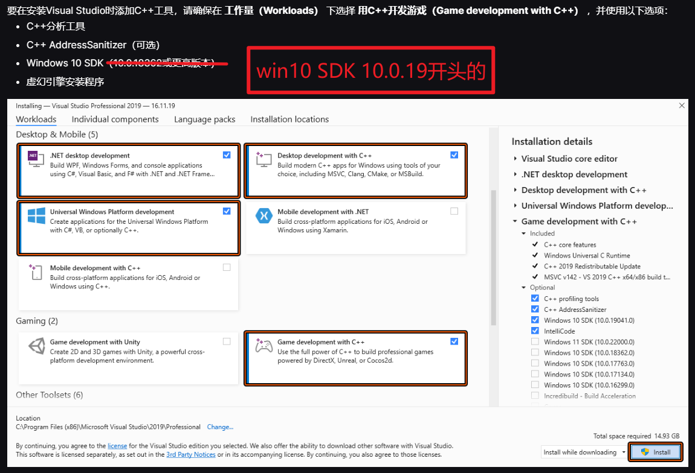
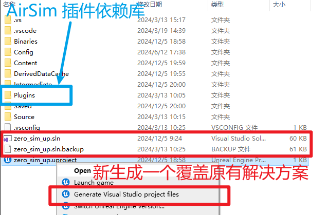
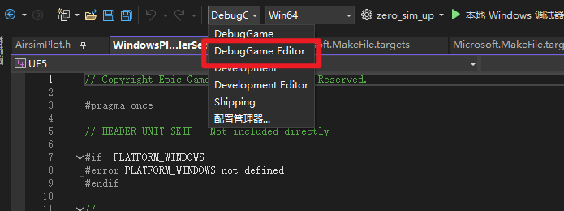

# UE5.3-AirSim仿真环境搭建
## 1. 下载 UE5 安装包

下载的流程参考官方文档：[最强大的实时3D创作工具 - Unreal Engine](https://www.unrealengine.com/zh-CN/download)

## 2. 下载 VS2022-LTSC-17.10 安装程序进行安装

注意，VS2022 小版本的 17.10 是必须的，其他版本会出现编译问题
- 报错问题参考官方社区 issue：[UE5.3 cannot create a C++ project using the latest VS2022, and compiles with errors](https://forums.unrealengine.com/t/ue5-3-cannot-create-a-c-project-using-the-latest-vs2022-and-compiles-with-errors/1880238)
- 目前这个是 UE5 的 Bug 注意不要更新 VS2022 了

历史版本下载地址：[Visual Studio 2022 发行历史记录 | Microsoft Learn](https://learn.microsoft.com/zh-cn/visualstudio/releases/2022/release-history)

## 3. 在 VS 安装程序勾选必要依赖

这里可以参考官方文档的安装步骤
- [为虚幻引擎C++项目设置Visual Studio开发环境 | 虚幻引擎 5.5 文档 | Epic Developer Community](https://dev.epicgames.com/documentation/zh-cn/unreal-engine/setting-up-visual-studio-development-environment-for-cplusplus-projects-in-unreal-engine)

安装时注意勾选必要的组件，这里由于项目原因选用 win 10 SDK 19041 版本

之后可以参考文档配置一下 VS 2022 的设置

## 4. 导入 AirSim 插件的工程

这里我们已经有一个安装了 AirSim 的插件 UE5工程，可以直接导入到 VS2022 中
不过由于每台计算机的平台不一样，可能直接编译 sln 解决方案会出现问题
这里建议把目录中的 sln 后缀一个 .backup 后缀，然后右键 UE5 工程产生新的解决方案 sln
文件，然后覆盖掉原来的 sln 文件

之后在编译解决方案时选用这个编译器

然后这个 Plugins 文件夹非常重要，可以把它复制到任何一个虚幻引擎的工程中，这样就可以使用 AirSim 插件了

但是直接把 Plugins 文件夹复制到其他 UE 项目中可能还需要配置其他东西，为了节省大家的精力，大家直接学习 UE 操作逻辑在原有的 UE 项目中进行场景搭建即可

## 5. 之后就可以参考上级链接进行 AirSim API 和 UE5 的基础学习

