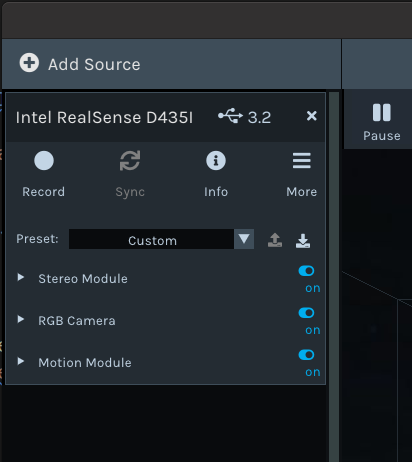

# D435i 配置教程

Author：@liangbm3(梁倍铭)  
Revise：@skyswordx(袁越)
Date：2025.1.12

# 1. RealSense 环境搭建
简单来说，就是要安装 Realsense 系列的 SDK 驱动 + 安装 ROS-wrapper
### 1.1 librealsense-SDK 驱动安装

这一步是安装 SDK，也就是安装驱动，以便让摄像头可以被电脑识别并正确使用
> tips: 特别要注意 ubuntu 系统版本、相应 SDK 版本要和摄像头的固件相匹配
> **直接根据本文档版本进行配置即可**
> [摄像头官方文档](https://dev.intelrealsense.com/docs/docs-get-started) && [驱动仓库](https://github.com/IntelRealSense/librealsense)

克隆驱动仓库（指定版本，踩过坑，驱动版本需要和固件相对应）
```bash
git clone -b v2.50.0 https://github.com/IntelRealSense/librealsense  
```
克隆可能会发生错误，可以直接在该页面下载压缩包：
https://github.com/IntelRealSense/librealsense/tree/v2.50.0

安装依赖：
```bash
sudo apt-get install libudev-dev pkg-config libgtk-3-dev
sudo apt-get install libusb-1.0-0-dev pkg-config
sudo apt-get install libglfw3-dev
sudo apt-get install libssl-dev
```

安装权限脚本(进入`librealsense-2.50.0`文件夹执行以下命令)：
```bash
sudo cp config/99-realsense-libusb.rules /etc/udev/rules.d/
sudo udevadm control --reload-rules && udevadm trigger 
```

编译和安装：
```bash
mkdir build
cd build
cmake ../ -DBUILD_EXAMPLES=true
make
sudo make install
```

>如果编译过慢可以使用`make -j8`命令

测试：
```bash
realsense-viewer
modinfo uvcvideo | gr
```

>插入摄像头屏幕可能发生翻转：重启即可

**注意**：  
USB线必须使用3.0以上的，同时如果在虚拟机中需要将USB兼容性改为3.1，参考链接：<https://blog.csdn.net/qq_28872655/article/details/131452813>

显示如图界面则成功  


### 1.2 RealSense-ROS1 接口安装

这一步是安装 Realsense 系列的 ROS-wrapper，注意要先安装好 ROS 系统
> tips: 特别要注意 ubuntu|ROS 的系统要和支持的 ROS-wrapper 版本进行匹配确认
> 跟着官方教程文档: [RealSense官方文档](https://dev.intelrealsense.com/docs/ros2-align-depth)配置好相对应的 ROS 1 和 SDK
> 使用 Ubuntu 20.04 的是 noeticROS 发行版，搭配的是 realsense-ros-2.3.2 的 git 仓库

创建ROS工作区：
```bash
mkdir -p ~/realsense_ros_ws/src
cd ~/realsense_ros_ws/src
```

克隆仓库：
```bash
git clone https://github.com/IntelRealSense/realsense-ros.git
git clone https://github.com/pal-robotics/ddynamic_reconfigure.git
```

列出仓库中的所有标签，切换到2.x.x的最新版本：
```bash
cd realsense-ros/
git checkout `git tag | sort -V | grep -P "^2.\d+\.\d+" | tail -1`
```

初始化ROS工作区：
```bash
cd ../../
cd ~/realsense_ros_ws/src
catkin_init_workspace
```

进行编译：
```
cd ..
catkin_make clean
catkin_make -DCATKIN_ENABLE_TESTING=False -DCMAKE_BUILD_TYPE=Release
catkin_make install
```

设置环境变量：
```bash
echo "source ~/realsense_ros_ws/devel/setup.bash" >> ~/.bashrc
source ~/.bashrc
```

启动摄像头节点：
```bash
roslaunch realsense2_camera rs_camera.launch
```
此时可以用`rostopic`来查看相关话题  
其他内容自行参考如下链接学习：  
<https://github.com/IntelRealSense/realsense-ros/tree/2.3.2> 

> tips: 上述的教程的SDK版本为v2.50.0，对应的固件版本为v5.13.0.50，需要使用3.0及3.0以上数据线和数据接口，不然会报错。如果要使最新版本，可自行探索。附上固件下载地址：<https://dev.intelrealsense.com/docs/firmware-releases-d400>

# 2. 学习 Realsense-ROS 接口

主要看软件包 `realsense_camera` 和软件包 `realsense_ddynamic`
还有 `launch` 文件 `rs_camera`，一般一开始都是跑跑 `launch` 文件

## 3. 参考链接

官方文档系列
- [ROS-wrapper-for-Realsense的github仓库](https://github.com/IntelRealSense/realsense-ros)
	这是 Realsense 系列摄像头的 ROS 软件包仓库，官方已经把使用摄像头的基本操作封装成 ROS 软件包了，我们主要是使用 ROS 软件包在此基础上进行操作和开发
- [ROS官方wiki对RealSense的介绍](https://wiki.ros.org/RealSense)
	这是 ROS 官网 wiki 对其相关软件包的介绍，可以知道软件包的种类和组成
-  [RealSense官方文档](https://dev.intelrealsense.com/docs/ros2-align-depth)
	这是 Realsense 系列摄像头的使用官方文档，包括了摄像头驱动 SDK 的安装、刷写摄像头固件的操作（注意 2 者版本要相互匹配）还包括了直接用 SDK 进行开发的教程和使用 ROS 进行操作的教程

安装与配置时
+ [Melodic + Realsense D435i 配置及错误问题解决](https://blog.csdn.net/Hacker_MAI/article/details/107976049)
+ [Intel RealSense D435i:简介、安装与使用(ROS、Python)](https://zhaoxuhui.top/blog/2020/09/09/intel-realsense-d435i-installation-and-use.html)
+ [编译SDK在cmake时出现问题](https://github.com/IntelRealSense/librealsense/issues/11927)


使用时的问题和解决方案
- 注意 [D435不能四个infra都开](https://github.com/IntelRealSense/realsense-ros/issues/2753) 这里是 D435 不是 D435i
- 使用 [红外数据要使用USB3](https://github.com/IntelRealSense/realsense-ros/issues/2120)

接口学习时
-  [1.一个接口学习的blog](https://zhaoxuhui.top/blog/2020/09/09/intel-realsense-d435i-installation-and-use.html)
-  [2.还是那个作者](https://zhaoxuhui.top/blog/2020/09/25/intel-realsense-D435i-ROS-API-notes.html)
-  [rs_camera.launch的参数解释](https://blog.csdn.net/wt15172486270/article/details/132596736)
-  [笔记9学习ros图形化工具](https://www.cnblogs.com/linuxAndMcu/category/1424081.html)
-  [硬件D435参数](https://blog.csdn.net/weixin_52031103/article/details/123999674)
-  [与RealSense相关的cmake编写](https://blog.csdn.net/guangqianzhang/article/details/125930325)
-  [我感觉D435i的使用有必要写出一篇教程，什么烧写升级固件，更改分辨率帧率，标定，发布IMU数据等等_d435i发布imu-CSDN博客](https://blog.csdn.net/sinat_16643223/article/details/118959961)

