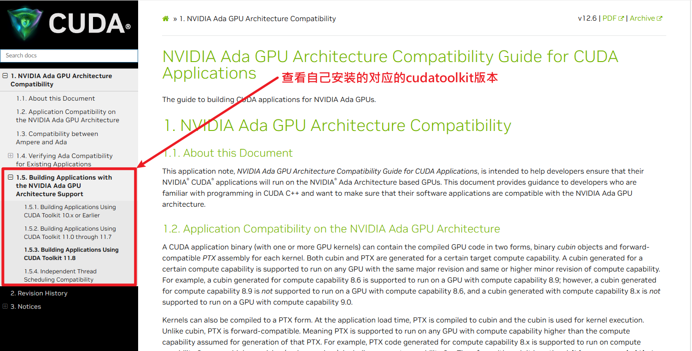
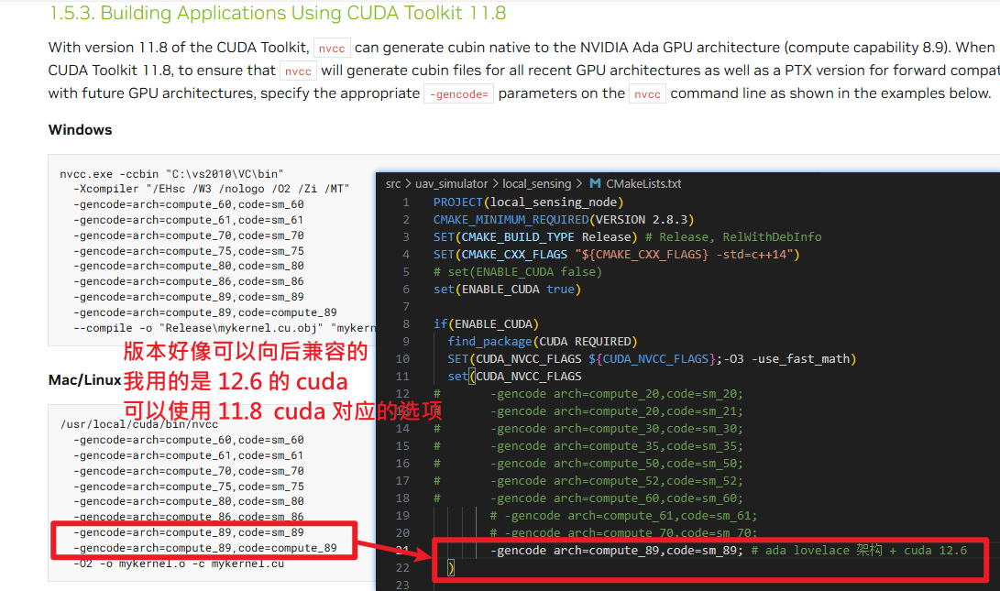

# 复刻使用 NVCC 编译时版本选项会遇到的一些问题

Author：@skoyhs(袁越)
Date：2024.12.18

## 1. 显卡架构、cuda-tooklit 和 nvcc 编译选项

这个项目如果不配置好 cuda 的话，在 catkin_make 之后运行节点会有问题
- 出现问题的参考 issue：[Tracker does not move · Issue #4 · ZJU-FAST-Lab/Elastic-Tracker](https://github.com/ZJU-FAST-Lab/Elastic-Tracker/issues/4)
- 如果不使用 cuda 的话，就要在 `src/uav_simulator/local_sensing/CMakeLists.txt` 中进行修改，切换注释 `ENABLE` 选项。但是这样就没有办法使用深度图功能了，具体参考上面 issue

言归正传，最好还是配置好 cuda，那么这里要确定 3 个东西，分别是自己的显卡架构、cuda-tooklit 版本和 nvcc 编译选项
- 显卡架构：可以通过 `nvidia-smi -q`，然后查看输出的 `Product Attributes` 来确定
- cuda-tooklit 版本：可以通过 `nvcc --version` 来确定

首先要知道自己显卡的架构，然后以 NVIDIA XXX GPU Architecture Compatibility 为关键词查找到类似的官方网页，如 [NVIDIA Ada GPU Architecture Compatibility Guide](https://docs.nvidia.com/cuda/ada-compatibility-guide/index.html#building-applications-using-cuda-toolkit-11-8)

或者用这两个链接 [link1](https://arnon.dk/matching-sm-architectures-arch-and-gencode-for-various-nvidia-cards/) or [link2](https://github.com/tpruvot/ccminer/wiki/Compatibility) 进行查看

然后在这个网页中查看自己安装好的 cuda-tooklit 版本支持哪些 nvcc 编译选项

然后看自己能够支持的 `nvcc` 编译器的选项，然后在项目的 `src/uav_simulator/local_sensing/CMakeLists.txt` 中修改 `CUDA_NVCC_FLAGS `
具体参考：

之后再编译就可以看到正常的 GPU 渲染的等高颜色图了。

## 2. to-be-continued
