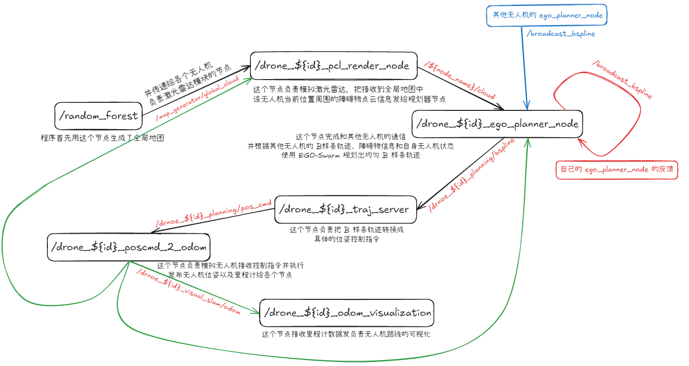

# EGO-Swarm 项目的学习

Author:@skyswordx(袁越), ...  
Date:2025.2.7

## 参考链接

- [EGO_planner代码中的状态机 - 知乎 (zhihu.com)](https://zhuanlan.zhihu.com/p/570040122)
- [EGO-Planner论文阅读笔记 - 知乎 (zhihu.com)](https://zhuanlan.zhihu.com/p/366372048)

## EGO-Swarm 的节点图整理




从节点图的整理来看，我们要把这个项目部署到真机，主要需要注意的接口为：
1. `ego_planner_node` 接收外部传感器的数据：无人机位姿和点云信息，更细致一点来说是由 `GridMap` 类接收外部传感器的数据，可以选择深度相机或者激光点云，相机位姿或机体位姿）
2. `traj_server` 向无人机发送控制指令

于是下面关注接口节点的具体实现，这两个节点都位于项目源码的 `/planner/plan_manage/` 部分
```shell
. # EGO-Swarm 源码根目录
├── planner # EGO-Swarm 规划器，包含节点和依赖库实现
│      ├─ bspline_opt
│      ├─ drone_detect
│      ├─ path_searching
│      ├─ plan_env
│      ├─ rosmsg_tcp_bridge
│      ├─ traj_utils
│      └─ plan_manage # 负责 ego-planner\traj_server 两个节点
└── uav_simulator # 仿真环境的节点实现
```


