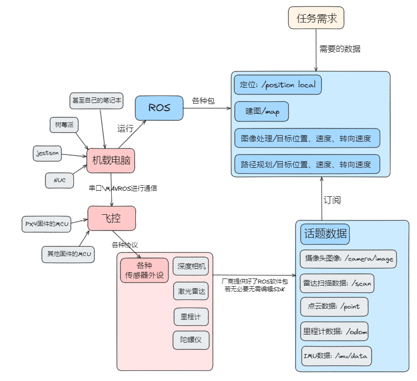
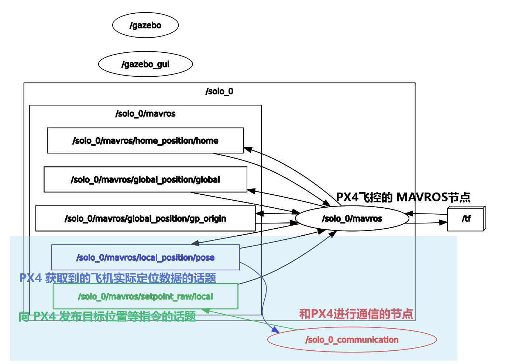

# PX4-ROS-LEARNING

Author:@skyswordx(袁越)  
Date:2024.12.18

## 参考链接

这里是 PX4 官方文档的资料
- [PX4 文档主页 (px-4.com)](https://px-4.com/main/index.html)
- [PX4 文档教程 (px-4.com)](https://px-4.com/main/en/getting_started/px4_basic_concepts.html)
- [PX4 自动驾驶用户指南 (v1.13)](https://docs.px4.io/v1.13/zh/)
- [使用 PX4-SDK 来控制 PX4](https://docs.px4.io/main/zh/modules/hello_sky.html)
	- [针对不同平台编译 PX4 代码](https://docs.px4.io/main/zh/dev_setup/building_px4.html#gazebo-classic)
- [编写 ROS 包通过 MAVROS 控制 Offboard 模式的 PX4](https://docs.px4.io/main/zh/ros/mavros_offboard_cpp.html)
	- [PX4-ROS-Gazebo 联合仿真](https://docs.px4.io/main/zh/simulation/ros_interface.html)

这里是 XTDrone 官方文档资料和仓库
- [XTDrone + PX4 1.13 版本 使用文档（Beta测试版） (yuque.com)](https://www.yuque.com/xtdrone/manual_cn/install_scripts)
- [robin-shaun/XTDrone: UAV Simulation Platform based on PX4, ROS and Gazebo (github.com)](https://github.com/robin-shaun/XTDrone)

使用 XTDrone 平台进行 PX 4-ROS 仿真部分参考的的视频链接
- [XTDrone 第4讲：键盘控制代码精讲_哔哩哔哩_bilibili](https://www.bilibili.com/video/BV1jJ46eiEDJ/?spm_id_from=333.880.my_history.page.click&vd_source=9c85d181a345808c304a6fa2780bb4da)

一个基于 XTDrone 移植 EGO-Swarm 到到 PX4-ROS 的 github 工程
- [XXLiu-HNU/Fast-Drone-250-v2: autonomous drone for Gazebo simulation (github.com)](https://github.com/XXLiu-HNU/Fast-Drone-250-v2)

在使用 XTDrone 时会遇到的一些 trouble shooting
- [Command ‘python‘ not found, did you mean: command ‘python3‘ from deb -CSDN](https://blog.csdn.net/m0_66238629/article/details/128681069)
- [ROS:ModuleNotFoundError: No module named ‘rospkg‘ -CSDN](https://blog.csdn.net/qq_42995327/article/details/119357775)

可能有用的 blog
- [AcmeUav (zenglong.xyz)](http://zenglong.xyz/page/3/#blog)


## 从零开始的 PX4-ROS 之旅

因为 PX4 的 SDK 会随着版本变化而更新，并且 PX4 的飞控源码过于庞大复杂，实际上我们在开发的时候应该**不是直接使用 SDK**，而是参考 SDK 做好的 **MAVROS 通信接口来进行 ROS 软件包的开发**，所以重点关注的就是如何使用 MAVROS 来和 PX4 固件里面的基础模块互相通信了

下面是是 ROS 无人机项目的大概框图，当我们在使用一个 ROS 无人机项目时，最好能大概知道项目的各个节点中有话题和服务在传递，各个节点是怎么协作的，这样我们就可以更好地理解整个项目的结构，然后在后续进行魔改



这就需要我们重点关注运行项目时，项目提供的 `launch` 文件，这些文件里面包含了各个节点甚至是各个模块的启动顺序，可以是我们了解一个项目的入口

然后在运行项目时，我们可以通过善用 ROS 终端工具来查看项目的节点之间的关系、发布的话题消息、服务有哪些（对于终端工具有个印象即可，不必记 api，但是要想起来要理清项目结构需要获取那些信息，然后去查对应的命令）
## PX4-ROS 和 Gazebo 仿真的关系

在进行 PX4-ROS 软件包开发时，除了直接上真机，又可以借助 Gazebo 进行可视化和仿真验证。然后实际上要运行 PX4-ROS 和 Gazebo 的仿真环境，就是运行其源码下的 `/launch` 文件夹内的 `launch` 启动文件 （比如使用 `roslaunch px4 xxx.launch`）

在 PX4 源码 SDK 中已经做好了和 Gazebo 进行仿真的准备，在其源码下 `/Tools/sitl_gazebo` 这个路径就提供好了一系列 Gazebo 可以识别的模型文件和世界文件（`sdf` 文件） 

然后实际上我们按照自己的需求设置 PX4-ROS 的仿真环境就是在编辑 PX4 的 `launch` 启动文件。当然不必每次都需要去从头手搓个 `launch` 文件来搭建仿真环境，生态成熟的社区是会有专门的脚本工具帮我们格式化生成相应的 `launch` 文件的，这就是所谓的仿真平台

XTDrone 就是一个开源的 PX4-ROS 仿真平台，它提供了**一系列预设**的 `python` 代码模块，可以格式化生成各种符合需求的 `launch` 文件（如室内 or 室外环境、单机 or 多机编队）也提供了一些用 MAVROS 协议和 PX4 固件的控制器通信的接口，在使用时可以直接 copy 添加进我们自己的 ROS 工作空间的软件包中

**其使用文档如下，推荐是先读完使用文档的前八个部分再看本篇文章以后的部分**
> [XTDrone + PX4 1.13 版本 使用文档（Beta测试版） (yuque.com)](https://www.yuque.com/xtdrone/manual_cn/install_scripts)


P.S.
> `utils` 是用来指代工具模块，存放一些常用的函数和类。这些函数和类通常是一些辅助性质的，可以用来简化代码、提高代码的可读性和可维护性

## PX4-ROS-Gazebo 仿真启动文件

这里主要是熟悉 PX4 的 `launch` 启动文件的配置，目前 PX4 主推使用 `sdf` 来建模环境和机器人，和寻常的 `urdf` 和 `xacro` 并不一样。但这不是重点，两者并没有什么本质的区别，都是使用 `xml` 来进行建模

主要要注意 PX4 官方提供的 `launch` 配置文件的格式，按照官方示例中给的 `<arg>` 标签参考的意义进行修改就可以达到其他自定义的效果了

其实最核心的就是要理解 `launch` 文件中 `xml` 格式的面向对象思想，整个文件就是用来配置仿真环境的，它把仿真环境抽象成了一个类的对象，可以通过引用其他类、设置不同命名空间来复用
- 在 ` launch ` 文件中，`<launch>` 标签就是代表整个仿真的对象
- 然后可以通过 `<arg name = xxx value =xxx>` 的方式指定当前 `launch` 对象的各个属性
- 还可以用 `<include file = xxx.launch>` 利用其他 `launch` 配置文件类的信息
- 并且利用 `<group ns = xxx_id>` 指定命名空间，这个命名空间就代表了单个的机器人。需要在命名空间内指定 ID 编号、sdf 物理模型、MAVROS 端口和其他属性（这个标签名字本身是 `xxx_id` 是为了和多机仿真的命名方式保持一致）
- 或者也可以分别指定多个命名空间来进行多机器人的配置，在 XTDrone 中已经实现了脚本自动生成一组命名空间来添加和管理多机器人

具体的 `launch` 文件示例参见 `/PX4_Firmware/launch`，这种文件具体负责什么见源码注释即可。这里概括一下，就是先导入仿真环境的世界 `world` 文件、设置 Gazebo 仿真器本身的一些偏好配置和本次仿真的参数，然后再导入机器人，其中包括机器人物理模型导入和位姿初始化、对应的 MAVROS 通信节点端口初始化等等

如果要更换不同的机器人的话，要利用 Vscode 中的 `ctrl+F` 来批量替换 `launch` 文件中的注释、 `<group ns=xxx>` 标签名字本身和命名空间内部的 `sdf` 物理模型信息
> 注意，这个 `sdf` 目录是放在 `PX4_Firmware/Tools/sitl_gazebo/models/` 下面的，由于每一个机器人的物理模型所配备的外设不一定都是对应的，直接一键替换有外设的机器人需要注意是否存在对应的 `sdf` 目录以及对应的 `sdf` 文件、在文件内部对应的外设 3D 文件路径是否正确等等


参考链接
- 单个无人机 ＋ 固定仿真地形：[配置与控制不同的无人机 (yuque.com)](https://www.yuque.com/xtdrone/manual_cn/vehicle_config)
- 多无人机自动化生成 `launch` 文件脚本：[多机型混合仿真支持 (yuque.com)](https://www.yuque.com/xtdrone/manual_cn/multi_vehicle)
- [【ROS-Gazebo】SDF机器人描述格式解析 - 知乎 (zhihu.com)](https://zhuanlan.zhihu.com/p/67470858)

## PX4 仿真 SDF 模型和传感器配置

正如上文提到的，在 `launch` 启动文件命名空间标签代表的就是一个机器人单体，其中的 `sdf` 属性指定的就是其 `sdf` 文件所在的 `sdf` 目录，都是位于源码 `/Tools/sitl_gazebo/models/ ` 下面的

一个合格的 `sdf` 目录要包含下面的要素
```shell
. # 机器人 xxx 的 SDF 目录
├── meshes # 机器人各个部位的 STL 三维模型
│      ├─ ...
│      ├─ ...
│      └─ ...
├─ model.config # 包含这个机器人模型的 SDF 文件版本号、作者以及描述信息
└── xxx.sdf # 类似于 urdf 包含各个 STL 文件的配合方式和几何、物理、碰撞信息
# 注意 model.config 中的 SDF 文件名和版本号要和实际文件里面的相符合
```

然后再来看看这个模型 `sdf` 文件的大致结构
```xml
<sdf version='1.6'> 
	<model name='iris'> 
	%% 模型中的各个部件实体就用 link 标签指定 %%
	    <link name='base_link'>
	    </link> 
	    %% 在一个模型里面只有一个叫做 base_link 的 link 标签作为主体
	    %% 在 link 标签里面有 colliison\visual\... 等子标签为这个实体指定属性
	    
	    <link name='/other_item_link'>
	    </link> %% 声明其他的部件也用 link 标签 %%	    
	    <joint name='/other_item_joint' type='...'>
	        %% 紧接着就用 joint 标签来指定各个 link 标签的关系 %%
	        <child>/other_item_link</child> 
	        <parent>base_link</parent>
	        ...
	    </joint>

	    <plugin name='xxx' file='libgazebo_xxx.so'>
	    </plugin> %% 用静态库为自己的部件在 Gazebo 仿真中添加对应的功能
	</model>
</sdf>
```

如果要为现成的 `sdf` 文件从外部导入其他部件作为传感器的话，就要使用 `<include>` 标签，在导入之后还是一样要像其他 `<link>` 标签部件一样用 `<joint>` 标签指定和 `base_link` 的关系
```xml
<include> %% 通过 url 导入 stereo_camera.sdf 文件%%
    <uri>model://stereo_camera</uri>
    <pose>...</pose>
</include>

%% 一样使用 joint 标签指定和 base_link 的关系
<joint name="stereo_joint" type="fixed">
    <child>stereo_camera::link</child>
    <parent>base_link</parent>
    ...
</joint>
```

在导入传感器部件时，这个来自于传感器的 `sdf`，比如这个就是 `stereo_camera.sdf`。这种模型的路径有两个，一个在 `~/.gazebo/models/` 下，另一个在 PX4 固件的路径下 `~/PX4_Firmware/Tools/sitl_gazebo/models/` 下，优先从前者找，因此我们在配置 PX4 的时候，那个一键安装脚本已经把 `~/.gazebo/models/` 下的双目相机模型删除

无人机的传感器部件有两类，一类是必须有的，一类是可以添加的。由于 XTDrone 的底层控制和状态估计来自于 PX4，因此必须有的传感器也是来自于 PX4 的状态估计需求，即加速度计、陀螺仪、磁罗盘、气压计；而 GPS 由于需要靠 mavlink 通信，因此也是默认配置的

可添加的包括了单目/双目相机、深度相机与2D/3D激光雷达

值得注意的是，按照这种方法添加的传感器，其插件发布的话题，都是带有无人机类型的前缀的，如 `/iris_0/stereo_camera/left/image_raw`

`
> 可以在 Vscode 中添加一些插件来预览 3D 模型，`sdf` 文件则使用 `xml` 解释器去渲染

参考链接
- [传感器配置 (yuque.com)](https://www.yuque.com/xtdrone/manual_cn/sensor_config)
- [第13讲：改变无人机上搭载的相机或雷达_哔哩哔哩_bilibili](https://www.bilibili.com/video/BV1JL46euE2k?spm_id_from=333.788.videopod.sections&vd_source=9c85d181a345808c304a6fa2780bb4da)

## PX4-ROS-Gazebo 仿真通信框架

这里主要介绍 PX4-ROS-Gazebo 仿真时，为了和其他 ROS 之间进行通信实现自动驾驶所需要的流程和框架

首先是然启动 `launch` 文件，之后，Gazebo 仿真器就已经启动，机器人和仿真世界的模型已经配置好了，机器人的 PX4 控制器的 MAVROS 通信节点已经建立了，这就意味着其他 ROS 节点可以与其进行交互（PX4 控制器节点会把数据持续发布到相关 MAVROS 话题，并且 PX4 控制器节点也会主动订阅 MAVROS 控制指令话题）

所以在 XTDrone 中就有相应的 `python` 脚本来实现了一个节点专门订阅 PX4 控制器的 MAVROS数据，并作为中转站向 PX4 控制器发布 MAVROS 指令（在该脚本中，是写死了订阅了以 `/xtdrone` 前缀开头的所有话题，其他 ROS 节点只需要把指令发送到对应的以 `/xtdrone` 前缀开头的话题即可）

因此，注意在配置仿真无人机的时候，上述脚本的启动有先后顺序，不能搞反了
```shell
# 1. 启动 PX4-ROS-Gazebo 仿真的 launch 文件
roslaunch px4 xxx.launch 

# 2. 启动 PX4 控制器和其他 ROS 节点通信的中转站节点
cd ~/XTDrone/communication
python multirotor_communication.py solo 0 
# solo 代表子机型，需要和 launch 文件中的机型相匹配，0 代表飞机的编号

# 3. 启动手动用按键控制无人机的 ROS 节点
cd ~/XTDrone/control/keyboard
python multirotor_keyboard_control.py solo 1 vel
# solo 代表子机型，1 代表飞机的个数，vel 代表速度控制
```

根据上述命令配置一个简单的 PX4-ROS 仿真之后的节点和话题关系图如下所示，这里暂时省略了 `/xtdrone` 前缀开头的所有话题，只有 PX4 控制器的 MAVROS 节点和中转 ROS 节点


参考链接
- [第3讲：配置与控制不同的无人机_哔哩哔哩_bilibili](https://www.bilibili.com/video/BV1xA46e7EKV?spm_id_from=333.788.videopod.sections&vd_source=9c85d181a345808c304a6fa2780bb4da)

## PX4-ROS-Gazebo 仿真通信节点的接口


参考链接
- [第4讲：键盘控制代码精讲_哔哩哔哩_bilibili](https://www.bilibili.com/video/BV1jJ46eiEDJ?spm_id_from=333.788.videopod.sections&vd_source=9c85d181a345808c304a6fa2780bb4da)
- [第5讲：Mavros通信代码精讲_哔哩哔哩_bilibili](https://www.bilibili.com/video/BV1EE46eTEg9?spm_id_from=333.788.videopod.sections&vd_source=9c85d181a345808c304a6fa2780bb4da)
## 配置 EKF 文件

参考链接
- [第7讲：无人机的EKF配置_哔哩哔哩_bilibili](https://www.bilibili.com/video/BV1SE421F7xS?spm_id_from=333.788.videopod.sections&vd_source=9c85d181a345808c304a6fa2780bb4da)


## 多机集群的仿真模型生成和通信启动


## EGO-SWARM 的 PX4-Gazebo 仿真

参考链接
- Fast-drone/...
- [第24讲：解决Ego在仿真中不能运行的问题_哔哩哔哩_bilibili](https://www.bilibili.com/video/BV13jtLexEwf?spm_id_from=333.788.videopod.sections&vd_source=9c85d181a345808c304a6fa2780bb4da)
- [第25讲：Egoplanner集群仿真_哔哩哔哩_bilibili](https://www.bilibili.com/video/BV1qAx5etEaV?spm_id_from=333.788.videopod.sections&vd_source=9c85d181a345808c304a6fa2780bb4da)
- [我觉得EgoPlanner没有宣传的那么好_哔哩哔哩_bilibili](https://www.bilibili.com/video/BV1HH4y1z78Q/?spm_id_from=333.337.search-card.all.click&vd_source=9c85d181a345808c304a6fa2780bb4da)


## VINS 深度相机内参标定

