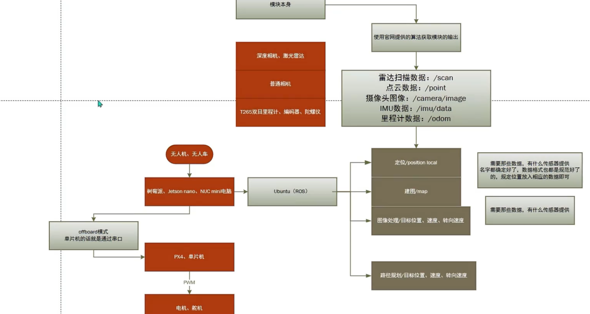

这是 ROS 无人机项目的大概框图，当我们在使用一个 ROS 无人机项目时，最好能大概从项目的各个节点中获取到这些信息，这样我们就可以更好地理解整个项目的结构

这需要我们重点关注运行项目时，项目提供的 `launch` 文件，这些文件里面包含了各个节点甚至是各个模块的启动顺序，可以是我们了解一个项目的入口

然后在运行项目时，我们可以通过善用 ROS 终端工具来查看项目的节点之间的关系、发布的话题消息、服务有哪些（终端工具有个印象即可，不必记 api，但是要想起来要理清项目结构需要获取那些信息，然后去查对应的命令）

P.S: 大家可以都去申请 github 学生包，可以用 VScode 在工作区或者文件内内联使用 o1-preview 但是这个需要进行身份信息的补完
- 2 FA
- authorization 令牌
- 学信网学生证明（deepl 翻译成英文）
- 学校邮箱
- 邮政编码

