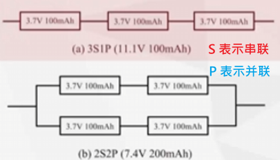

# 一些无人机硬件相关的关键词列表

Author：@skyswordx(袁越)  
Date：2024.12.21

这里列出来的参数和术语实际上和我们实际使用 ROS 开发无人机关系有一点但不是很大
大多的是一个常识性的东西有个印象即可，重点要知道的会使用**加粗**标记

机架指标
- 重量
- 轴距
- 布局
- 材料
	- 碳纤维
- 震动

起落架的功能
1. 支撑多旋翼重量保持机身水平
2. 避免飞机与地面接触发生摩擦
3. 减弱起飞和降落的气流对飞机的干扰
4. 消耗和吸收多旋翼在着陆时的撞击能量

动力系统指标
- 螺旋桨参数
	- 型号（直径和螺距）
	- 桨叶数（力效）
	- 安全转速
- 电机参数（无刷直流电机）
	- 内转子\外转子
	- 尺寸（定子直径和高度）
	- kv 值（空载情况下，外加 1 V 电压，电机得到的转速）
		- kv 小，力矩大，配合大直径的桨叶
- 电调参数 ESC
	- 最大持续电流
	- 刷新频率
	- 位数
	- 固件和支持协议
- **锂电池参数**
	- **组合、容量**、放电率参数
	 
	- 材料种类：一般是标准 LiPo 
		- 单芯电压额定 3.7
			- 如果低于 3.7 就是过放，会损坏电池
		- 单芯满电 4.2
		- 低于 3.6 无人机低电压报警

控制系统
- 飞控（最底层的系统，直接用电调对电机进行控制，采集各种传感器数据，设置模式）
	- 飞行模式（手动之类的）
- 传感器
	- 手动飞行最低传感器需求
		- 加速度计
		- 陀螺仪
	- 附加功能
		- 气压计
		- GPS
		- 磁力计
		- 距离传感器
		- 光流传感器
- 图传
- 数传电台
- SD 卡黑匣子
- 地面站（对飞控进行参数配置，显示飞行状态、视频流）
- 遥控器和接收机
	- 协议
	- 功率
- 上位机

**四旋翼，对角旋转方向相同，相邻旋翼方向相反用以抵消扭矩**
- 浆叶旋转的方向是叶面斜着向上那面切割空气的方向

**坐标系概念**
- 地理坐标系 (NED)"北-东-地”
	- 原点一般位于无人机起飞点，结合 GPS 信息控制
	- N 轴水平指北（x 轴）
	- D 轴指向地心（z 轴）
	- E 轴水平指东（y 轴）
	- 是右手系
- 运载体坐标系 (FRD)
	- 原点位于运载体质心
	- x 轴沿运载体纵轴，指向前方
	- y 轴沿运载体横轴，指向右翼
	- z 轴与 x 轴、y 轴构成右手系，指向运载体底部
- 姿态角（俯仰、横滚、偏航） 

机载电脑
- 用串口或者其他无线协议控制飞控
- 使用 `px4` 飞控
	- 机载电脑：MAVLink 协议（MAVSDK、**MAVROS**）
	- `px4` 飞控：offboard 模式

